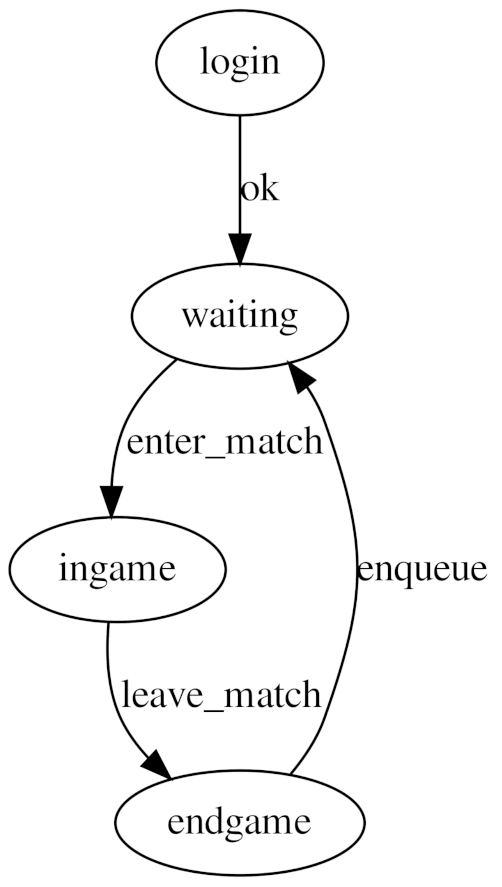
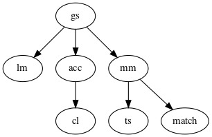

>>># Programação Concorrente

## Trabalho Prático - HoleIO

### Grupo 19

* André Sá A76361
* Jaime Santos A71739
* Paulo Barbosa A81480

# 1 Introdução

Este relatório tem como objetivo documentar a implementação do trabalho prático sugerido pelo docente da UC Programação Concorrente. Este divide-se em duas partes, um cliente e um servidor.

Do lado do cliente, foi implementada uma interface gráfica em Java (Processing) onde é desenhado um espaço 2D, limitado nos 4 lados preenchido por objetos comestiveis e por ambos os jogadores. Todos os avatares presentes são em forma de circulo. Estes são preenchidos a preto no caso dos jogadores, verde para objetos comestiveis benignos e vermelho para objetos comestiveis venenosos. No ecrã do jogador, o seu avatar deverá ter uma circunferência azul e o avatar do adversário uma circunferência vermelha. O movimento destes jogadores é feito premindo as setas ou WASD. O jogo termina quando o tempo limite é atingido (2 minutos) sendo que a pontuação de cada jogador é a sua massa no fim da partida. É necessário ainda garantir que o cliente comunique com o servidor através de sockets TCP.

Do lado do servidor, será necessário garantir o funcionamento de uma simulação do cenário do jogo, recebendo conexões e input dos clientes e também fazer chegar a estes informação para atualização da interface gráfica.

\pagebreak

# 2 Cliente

Para implementação do cliente, foi utilizado o _Processing_. 

Foi decidido utilizar duas _threads_, uma que comunica com o servidor para receber a informação de jogo relativa aos objetos e outra que desenha a interface gráfica com base nessa informação. O controlo de concorrência será conseguido através do uso de variáveis volatile, de modo a evitar _data race_.

Como elementos de jogo temos as classes `Player` e `Food`. Todos os jogadores são instâncias da classe `Player` e são compostos por variáveis:

 * De posição 2D que varia com o input do jogador.
 * De tamanho (raio) que varia com o que o jogador consome.
 * Booleanas que definem o jogador ou o adversário.

Todos os consumiveis são instâncias da classe `Food` que também sao descritas por variáveis de posição e tamanho e ainda uma variável Booleana que a descreve como comestivel ou venenosa.

A distância entre um jogador e um comestivel (podendo este comestivel ser da classe Food ou simplesmente o adversário) é calculada pela distância euclidiana, e se esta distância implicar que o objeto é todo contido dentro do jogador, então este é consumido e o tamanho (score do jogador) atualizado.

>>

São agora explicadas as classes referentes ao estado do jogo. Começando pelo Screen: este enumera as possiveis fases de jogo num determinado momento. Existem 5 no total, sendo estas, por ordem de execução, _login_, _inqueue_, _ingame_, _endgame_ e _leave_.

A classe _State_ contém informação sobre o estado do jogo, de maneira a facilitar a partilha de informação entre threads.

A classe _BGThread_ é iniciada após o _login_. Esta recebe o estado do _HoleIO_ que será manipulado com as informações recebidas do servidor. Existem duas funções principais nesta classe, `handle_inqueue` e `handle_ingame`. Na primeira, espera-se que comece um jogo e inicializa-se o estado do jogo. Caso a ligação seja terminada, o cliente termina. Na segunda, é atualizada a informação dos objetos do jogo de acordo com as mensagens recebidas do servidor, até este eventualmente terminar sessão.

Na classe `HoleIO` será criada a socket de comunicação com o servidor e tudo o que o utilizador vê desenhado na interface gráfica. Serão também definidos todos os controlos de teclado e rato.

\pagebreak

# 3 Servidor

Nesta parte do relatório, analisa-se a implementação de um servidor, para permitir uma experiência _multiplayer_, em _Erlang_.

O servidor implementado pode ser descrito pela seguinte arvore de supervisão:

De uma maneira mais detalhada, a árvore de cima pode ser descrita por:

 1. Um processo _GameServer_ (`gs`) que está encarregue de começar e parar os subordinados.
 2. Um processo _LoginManager_ (`lm`) que, quando recebe um novo cliente em pré-autenticação, lida com:
     1. Criação de conta: Caso já exista uma conta com um certo _User_ envia uma mensagem de rejeição, caso contrário adiciona a nova conta ao dicionário.
     2. _Login_: Caso certo _User_ já esteja _Online_, envia uma mensagem de rejeição, caso contrário o _login_ acontece e este _User_ é adicionado aos utilizadores _Online_.
     3. _Logout_: Após a pré-autenticação, o _User_ pode então fazer _logout_ que envolve ser removido dos utilizadores _Online_.

\pagebreak

 3. Um processo _MatchMaking_ (`mm`) que irá gerir as partidas e os resultados dos jogadores. Quando existirem 2 jogadores na _queue_ a partida irá começar. Os resultados dos jogadores serão atualizados quando a partida terminar, e isto pode acontecer de duas maneiras:
 	 1. Quando o tempo acaba e ambos os jogadores estão na partida; neste caso ambos os resultados serão atualizados no _TopScores_.
 	 2. Um dos jogadores sai a meio da partida; neste caso apenas o resultado do jogador restante será atualizado. 
 4. Um processo _Acceptor_ (`acc`) que começa por escutar na porta _default_. O _Acceptor_ aceita agora ligações durante um segundo, e caso uma seja efetuada, este cria um novo cliente e lê mensagens de processo. Caso não exista ligação durante esse tempo, verifica mensagens de processo e volta ao _Acceptor_.
 5. Os processos _Client_ (`cl`) tratam de comunicar ao cliente os novos estados da partida, isto engloba posições e tamanho dos jogadores, posições da comida e ainda os _TopScores_ do servidor no final da partida.
 6. Um processo _TopScore_ (`ts`) que trata de manter os 5 melhores resultados do servidor.
 7. Os processos _Match_ (`match`) que tratam de atualizar o estado do jogo de acordo com o _input_ dos jogadores.

\pagebreak

# 4 Conclusão

Refletindo sobre o nosso jogo, estamos contentes com o resultado em termos de jogabilidade, uma vez que conseguimos implementar todas as funcionalidades requiridas pelo professor.

No entanto, não estamos completamente satisfeitos com a parte gráfica do nosso jogo. Possíveis trabalhos futuros passariam por melhorar o aspeto do ecrã de login bem como adicionar opções de registo a este. No ecrã de ingame seria desejável incluir um botão de logout e talvez outras funcionalidades.
