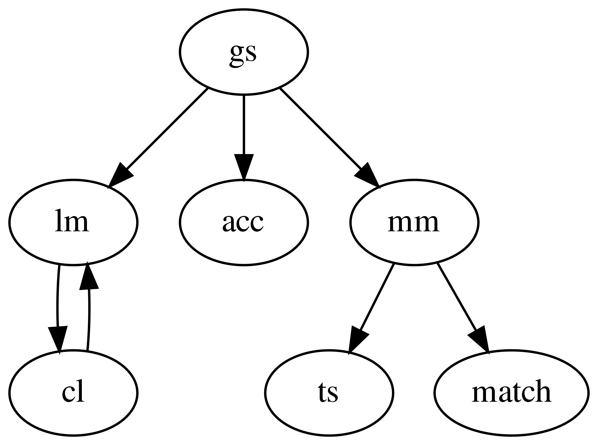
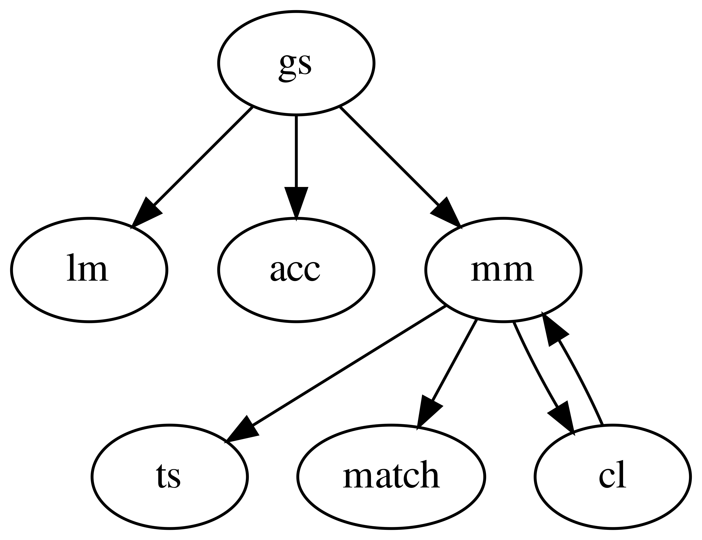
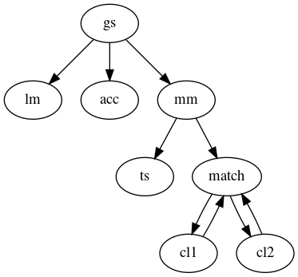

>>>#Programação Concorrente

##Trabalho Prático - HoleIO

###Grupo 19
* André Sá A76361
* Jaime Santos A71739
* Paulo Barbosa A81480

#1 - Introdução
Este relatório tem como objetivo documentar a implementação do trabalho prático sugerido pelo docente da UC Programação Concorrente. Este divide-se em duas partes, um cliente e um servidor.

Do lado do cliente, foi implementada uma interface gráfica em java (Processing) onde é desenhado um espaço 2D, limitado nos 4 lados preenchido por objetos comestiveis e por ambos os jogadores. Todos os avatares presentes são em forma de circulo. Estes sao preenchidos a preto no caso dos jogadores, verde para objetos comestiveis benignos e vermelho para objetos comestiveis venenosos. No ecrã do jogador, o seu avatar deverá ter uma circunferência azul e o avatar do adversário uma circunferência vermelha. O movimento destes jogadores é feito premindo as setas ou WASD. O jogo termina quando o tempo limite é atingido (2 minutos) sendo que a pontuação de cada jogador equivale à maior massa atingida durante a partida. É necessário ainda garantir que o cliente comunique com o servidor através de sockets TCP.

Do lado do servidor, será necessário garantir o funcionamento de uma simulação do cenário do jogo, recebendo conexões e input dos clientes e também fazer chegar a estes informação para atualização da interface gráfica.

\pagebreak

#2 - Cliente
Para implementação do cliente, foi utilizado o _Processing_. 

Foi decidido utilizar duas _threads_, uma que comunica com o servidor para receber a informação de jogo relativa aos objetos e outra que desenha a interface gráfica com base nessa informação. O controlo de concorrência será conseguido através do uso de variáveis volatile, de modo a evitar _data race_.

Como elementos de jogo temos as classes Player e Food. Todos os jogadores são instâncias da classe Player e são compostos por variáveis:

 * De posição 2D que varia com o input do jogador.
 * De tamanho (raio) que varia com o que o jogador consome.
 * De velocidade.
 * Booleanas que definem o jogador ou o adversário.

Todos os consumiveis são instâncias da classe Food que também sao descritas por variáveis de posição e tamanho e ainda uma variável Booleana que a descreve como comestivel ou venenosa.

A distância entre um jogador e um comestivel (podendo este comestivel ser da classe Food ou simplesmente o adversário) é calculada pela distância euclidiana, e se esta distância implicar que o objeto é todo contido dentro do jogador, então este é consumido e o tamanho (score do jogador) atualizado.

São agora explicadas as classes referentes ao estado do jogo. Começando pelo Screen, este enumera as possiveis fases de jogo num determinado momento. Existem 4 no total, sendo estas, por ordem de execução, _login_, _inqueue_, _ingame_ e _leave_.

A classe _State_ contem informação sobre o estado do jogo, de maneira a facilitar a partilha de informação entre threads.

A classe _BGThread_ é iniciada após o _login_. Esta recebe o estado do _HoleIO_ que será manipulado com as informações recebidas do servidor. Existem duas funções principais nesta classe, `handle_inqueue` e `handle_ingame`. Na primeira, caso nao receba nenhuma mensagem do servidor, termina-se a sessão, caso contrário, inicializa os objetos e começa o jogo. Na segunda, irá atualizar a informação dos objetos do jogo de acordo com as mensagens recebidas dos servidor, até o servidor eventualmente terminar sessão.

Na classe `HoleIO` será criada a socket de comunicação com o servidor e tudo o que o utilizador vê desenhado na interface gráfica. Serão também definidos todos os controlos de teclado e rato.

\pagebreak

**bold** _italico_ __*bold e italico*__

